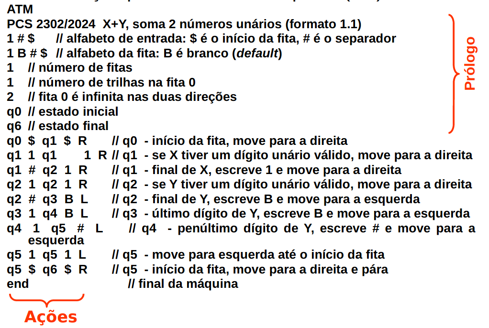

# PCS3616 - Laboratório 3 - Máquinas de Turing

Executar os comandos abaixo em um terminal. Em caso de dúvida ou
problemas, peça ajuda.

  -----------------------------------------------------------------------
  **Para colar um comando no terminal: Ctrl+Shift+V**
  -----------------------------------------------------------------------

  -----------------------------------------------------------------------

Instalação do Graphviz e Ruby (vamos usar para gerar as máquinas de
estado):

+-----------------------------------------------------------------------+
| sudo apt-get update\                                                  |
| sudo apt-get install -y graphviz\                                     |
| which dot \# Saída esperada: /usr/bin/dot\                            |
| sudo apt-get install ruby-dev                                         |
|                                                                       |
| sudo gem install byebug \--no-document                                |
|                                                                       |
| sudo gem install paint \--no-document                                 |
+=======================================================================+
+-----------------------------------------------------------------------+

Instalação do simulador e corretor:

+-----------------------------------------------------------------------+
| mkdir -p \~/Documents/pcs3616\                                        |
| cd \~/Documents/pcs3616                                               |
|                                                                       |
| mkdir aula3\                                                          |
| wget https://github.com/MiguelSarraf/pcs3616/archive/aula3.zip\       |
| unzip aula3.zip                                                       |
|                                                                       |
| rm aula3.zip                                                          |
|                                                                       |
| mv pcs3616-aula3/\* aula3/                                            |
|                                                                       |
| rmdir pcs3616-aula3                                                   |
|                                                                       |
| cd aula3/\                                                            |
| mkdir mts\                                                            |
| mkdir svgs\                                                           |
| mkdir dots                                                            |
+=======================================================================+
+-----------------------------------------------------------------------+

Gerando diagrama da Máquina de Turing:

  -----------------------------------------------------------------------
  ruby tm_to_dot.rb mts/sua_maquina.txt \> dots/sua_maquina.dot && dot
  -Tsvg dots/sua_maquina.dot -o svgs/sua_maquina.svg
  -----------------------------------------------------------------------

  -----------------------------------------------------------------------

Testar um caso:

+-----------------------------------------------------------------------+
| #Entra em um terminal Python                                          |
|                                                                       |
| python3\                                                              |
| #Importa a biblioteca\                                                |
| from turingmachine import \*\                                         |
| #Carrega a sua maquina\                                               |
| load(\"mts/sua_maquina.txt\")\                                        |
| #Executa um teste\                                                    |
| run(\"string com fita de entrada\")                                   |
+=======================================================================+
+-----------------------------------------------------------------------+

> Roda o testador padrão:

+-----------------------------------------------------------------------+
| #Entra em um terminal Python                                          |
|                                                                       |
| python3\                                                              |
| #Importa a biblioteca\                                                |
| from turingmachine import \*\                                         |
| #Carrega a sua maquina\                                               |
| load(\"mts/sua_maquina.txt\")\                                        |
| #Testa os casos padrao\                                               |
| test(\"inputs/arquivo_de_teste.in\")                                  |
+=======================================================================+
+-----------------------------------------------------------------------+

**ATENÇÃO**: "sua_maquina.txt" não é um arquivo dentre os que você
baixou, você tem que substituir esse arquivo pelo que você escrever.

OBS.: você pode criar scripts Python para realizar os passos acima, isso
economiza tempo e evita typos.

Resolução dos exercícios

1\. Projetar e implementar as seguintes máquinas de Turing (o arquivo da
MT deve ter um dos seguintes nomes, de acordo com o exercício):

1)  **mt_soma.txt**

> Implementar uma MT que calcule a soma x + y. Veja o formato da
> resposta no arquivo de exemplo (inputs/ex1-soma.in).

2)  **mt_subtracao.txt**

> Implementar uma MT que calcule a soma x - y, com x \> y e **tratamento
> de erros** (veja as observações abaixo). Veja o formato da resposta no
> arquivo de exemplo (inputs/ex2-subtracao.in).

3)  **mt_soma_binaria.txt**

> (DESAFIO! (Mas vale nota)) Implementar uma MT que calcule a soma x + y
> em binário, com tamanho máximo de dígitos limitado a 8. Veja o formato
> da resposta no arquivo de exemplo (inputs/ex4-soma-binaria.in).

**Observações:**

-   Nos exercícios 1 e 2, a representação de todos os valores é em
    > unário: 0 = 1, 1 = 11, 2 = 111, \...

-   No exercício 3, a representação de todos os valores é em binário: 0
    > = 0, 1 = 1, 2 = 10, 3 = 11, ...

-   Todos os exercícios possuem exemplos de entrada e saída, nos
    > arquivos do diretório **inputs/XXXXX.in** (por exemplo, os
    > exemplos de execução para o exercício 1 estão em
    > **inputs/ex1-soma.in**.

-   Tratamento de erros: nesta aula, isso significa que a sua MT, se
    > receber entradas inválidas para processar, [não pode entrar em um
    > loop infinito]{.underline}, e também não deve terminar em um
    > estado de aceitação (estado final). A máquina deve parar em
    > qualquer estado que não seja final (você pode, inclusive, criar um
    > estado só para casos de erro), e o conteúdo da fita pode ser
    > qualquer coisa (para nós, o conteúdo não é relevante se a máquina
    > deu erro).

5\. Enviar para o Sharif Judge **se estiver correto**:

> 5.1 Criar um arquivo zip com o arquivo da MT e o SVG do diagrama de
> transição, dar o nome correspondente ao exercício (e.g.,
> \"mt_soma.zip\") e enviar.

6\. Repetir para os demais exercícios.

**Padrão do arquivo da MT:**

{width="6.270833333333333in" height="4.15625in"}
